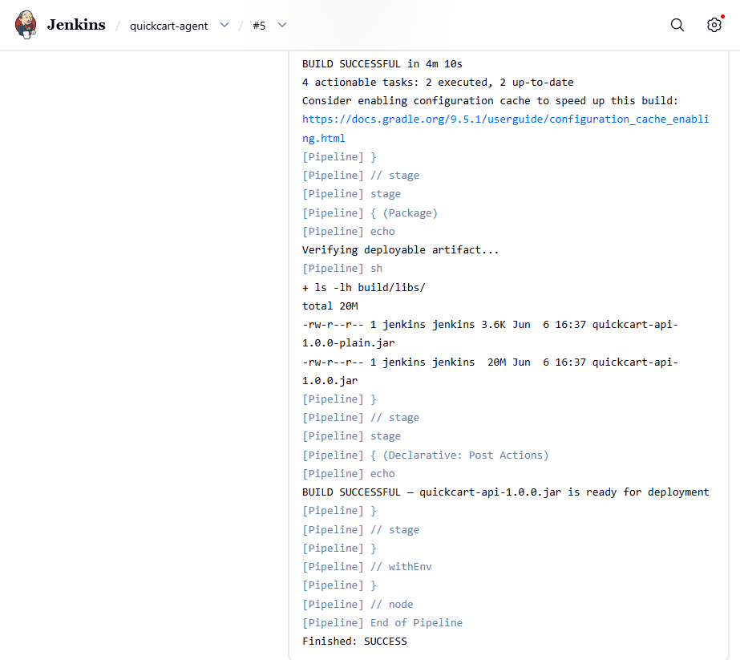
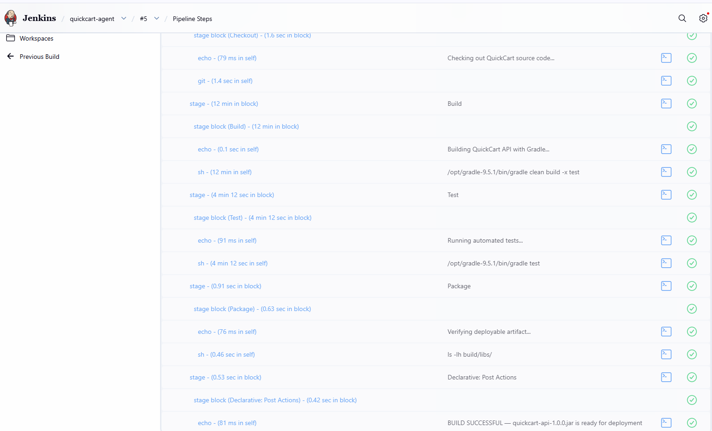
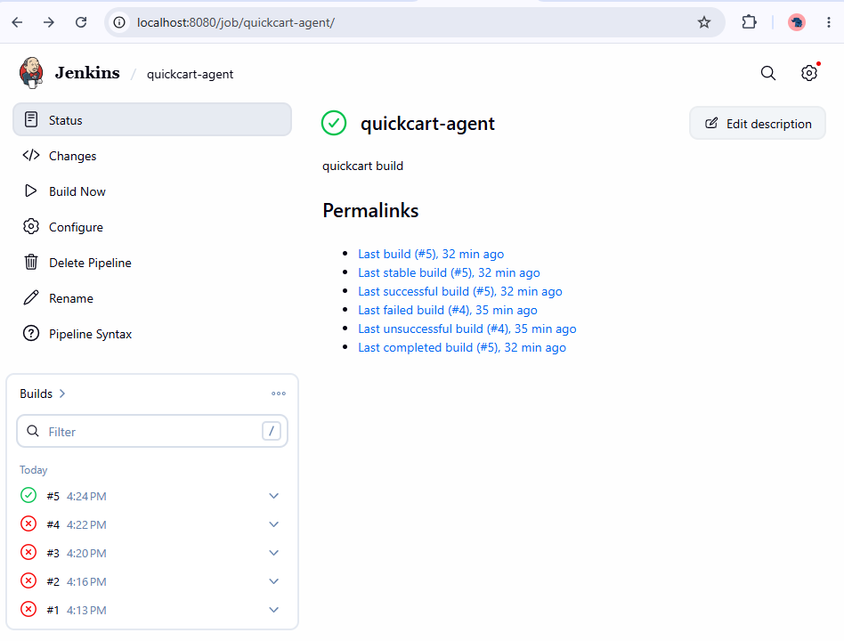

# codealpha-jenkins-remoting

**QuickCart API  Distributed Build System with Jenkins**

> Part of the QuickCart DevOps Pipeline Series | CodeAlpha DevOps Internship Task 2

---

## Business Context

After standardising the build process with Gradle, QuickCart faced a new problem:

> *"The single build server was overwhelmed. Every developer pushing code triggered a build. Builds were queuing. Developers were waiting. The team was slowing down."*

This repository solves that problem by introducing a **Jenkins Master + Agent architecture** — a distributed build system where one server manages the work and separate worker machines execute the builds.

---

## What This Repository Demonstrates

| Concern | Without This | With This |
|---|---|---|
| Build server load | Single server handles everything | Master delegates to Agents |
| Scalability | Adding developers breaks the system | Add more Agents as team grows |
| Build isolation | Builds interfere with each other | Each Agent runs independently |
| Visibility | No central record of builds | Jenkins dashboard tracks every build |
| Automation | Developers run builds manually | Every code push triggers a build |

---

## Architecture

```
Developer pushes code to GitHub
            │
            ▼
    Jenkins Master (Port 8080)
    ─────────────────────────
    │  Manages the pipeline  │
    │  Assigns build jobs     │
    │  Shows dashboard UI     │
    └────────────┬────────────┘
                 │ communicates via Port 50000
                 ▼
    Jenkins Agent (quickcart-agent)
    ─────────────────────────────
    │  Receives build jobs        │
    │  Runs gradle clean build    │
    │  Produces the JAR artifact  │
    └─────────────────────────────┘
```


---

## Technology Stack

| Technology | Version | Purpose |
|---|---|---|
| Jenkins | LTS | CI/CD automation server |
| Docker | Latest | Container runtime |
| Docker Compose | v3.8 | Multi-container orchestration |
| Java | 17 (Temurin) | Required by the QuickCart application |
| Gradle | 9.5.1 | Build tool running inside the container |

---

## Project Structure

```
codealpha-jenkins-remoting/
│
├── docker-compose.yml      # Defines Master + Agent containers and network
├── Dockerfile.master       # Builds Master image with pre-installed plugins
├── Dockerfile.agent        # Builds Agent image with Java 17 and Gradle
├── Jenkinsfile             # Pipeline definition (Checkout → Build → Test → Package)
└── README.md               # Documentation
```

---

## Prerequisites

| Requirement | Download |
|---|---|
| Docker Desktop | https://www.docker.com/products/docker-desktop |

Verify Docker is running:
```bash
docker --version
docker-compose --version
```

---

## Setup Instructions

### Step 1: Clone this repository

```bash
git clone https://github.com/Mexcelcloud/codealpha-jenkins-remoting.git
cd codealpha-jenkins-remoting
```

### Step 2: Start Jenkins Master and Agent

```bash
docker-compose up -d
```

This command:
- Builds the Master image with pre-installed plugins (Pipeline, Git, Instance Identity)
- Builds the Agent image with Java 17 and Gradle 9.5.1
- Creates a private network between them
- Starts both containers in the background

Verify both containers are running:
```bash
docker ps
```

Expected output:
```
CONTAINER ID   IMAGE             STATUS         NAMES
xxxxxxxxxxxx   jenkins-master    Up 2 minutes   jenkins-master
xxxxxxxxxxxx   jenkins-agent     Up 2 minutes   jenkins-agent
```

### Step 3: Access Jenkins Dashboard

Open your browser and go to:
```
http://localhost:8080
```

Jenkins opens directly to the dashboard — no setup wizard because plugins are pre-installed via `Dockerfile.master`.

### Step 4: Connect the Agent

1. Go to **Manage Jenkins → Nodes → New Node**
2. Node name: `quickcart-agent`
3. Select **Permanent Agent** → click **Create**
4. Fill in:
   - Remote root directory: `/home/jenkins/agent`
   - Labels: `quickcart-agent`
   - Launch method: **Launch agent by connecting it to the controller**
5. Click **Save**
6. Copy the **secret token** shown on the agent page

### Step 5: Start the Agent with the Secret

Create a `.env` file in the project folder:
```bash
echo "JENKINS_SECRET=your_secret_token_here" > .env
```

Replace `your_secret_token_here` with the token you copied from Jenkins.

Restart the containers:
```bash
docker-compose down
docker-compose up -d
```

### Step 6: Copy Gradle into the Master Container

Since the Jenkins container runs in an isolated environment, copy Gradle directly from your machine:

```powershell
docker cp C:\Gradle\gradle-9.5.1 jenkins-master:/opt/gradle-9.5.1
```

### Step 7: Copy Gradle Cache into the Master Container

Copy your local Gradle dependency cache so the build does not need internet access:

```powershell
docker cp $env:USERPROFILE\.gradle jenkins-master:/var/jenkins_home/.gradle
docker exec -u root jenkins-master chown -R jenkins:jenkins /var/jenkins_home/.gradle
```

### Step 8: Create the Pipeline

1. Go to Jenkins dashboard → **New Item**
2. Name: `quickcart-pipeline`
3. Select **Pipeline** → click **OK**
4. Under **Pipeline** section select **Pipeline script**
5. Paste the contents of `Jenkinsfile`
6. Click **Save**

### Step 9: Run the Pipeline

Click **Build Now** on the pipeline page.

---

## Pipeline Results

A successful build produces the following across all 4 stages:

All stages complete with green checkmarks:

```
✔ Checkout  → Code pulled from GitHub
✔ Build     → gradle clean build → BUILD SUCCESSFUL in 12m 53s
✔ Test      → All automated tests passed in 4m 10s
✔ Package   → quickcart-api-1.0.0.jar (20MB) verified and ready
```



Final console output confirms:
```
BUILD SUCCESSFUL — quickcart-api-1.0.0.jar is ready for deployment

```

---

## Jenkins Dashboard

The Jenkins dashboard shows the pipeline status and build history at a glance:



Build history tracks every run — successful and failed — giving full visibility into the delivery pipeline:



---

## Understanding the Jenkinsfile

```groovy
pipeline {
    agent any  // Run on any available executor
```
> Tells Jenkins to run this build on any available executor. In a full Master + Agent setup this would be `agent { label 'quickcart-agent' }` to target a specific Agent node.

```groovy
    stages {
        stage('Checkout') { ... }   // Pull source code from GitHub
        stage('Build')    { ... }   // Run gradle clean build
        stage('Test')     { ... }   // Run automated tests
        stage('Package')  { ... }   // Verify JAR was produced
    }
```
> Each stage is a visible step in the Jenkins dashboard. If any stage fails, the pipeline stops and reports exactly where the failure occurred. No broken code moves forward.

```groovy
    post {
        success { echo "BUILD SUCCESSFUL..." }
        failure { echo "BUILD FAILED..." }
    }
```
> Post actions run after all stages complete. In production these would trigger Slack notifications, deployment steps, or artifact archiving.

---

## Challenges Encountered

This section documents the engineering problems encountered during setup, why they happened, and how they were resolved.

---

### Challenge 1: Jenkins Plugin Installation Failed (Offline Environment)

**What happened:**
After skipping the setup wizard due to no internet access inside the container, the New Item page only showed **Freestyle Project** — the **Pipeline** option was missing.

**Why it happened:**
The Pipeline feature in Jenkins is not built-in. It requires the `workflow-aggregator` plugin and its dependencies. Since the container had no internet access, the normal plugin installation process failed silently.

**How it was resolved:**
A custom `Dockerfile.master` was created that pre-installs all required plugins at image build time using `jenkins-plugin-cli`:

```dockerfile
FROM jenkins/jenkins:lts
ENV JAVA_OPTS="-Djenkins.install.runSetupWizard=false"
RUN jenkins-plugin-cli --plugins \
    pipeline-model-definition \
    git \
    workflow-aggregator \
    instance-identity \
    ws-cleanup
```

This runs the plugin installation during `docker-compose up` before Jenkins starts, ensuring plugins are available on first boot.

---

### Challenge 2: Jenkins Agent Failed to Connect (X-Instance-Identity Error)

**What happened:**
The `jenkins-agent` container started successfully but kept printing this error every 10 seconds:

```
java.io.IOException: http://jenkins-master:8080/tcpSlaveAgentListener/ 
appears to be publishing an invalid X-Instance-Identity.
```

**Why it happened:**
The `instance-identity` plugin was missing from the Master. This plugin generates a cryptographic identity for the Jenkins controller. Without it, the Agent cannot verify it is connecting to a legitimate Jenkins Master and refuses the connection as a security measure.

Additionally, after rebuilding the Master container, the secret token changes. Using an old token from a previous container will always fail.

**How it was resolved:**
The `instance-identity` plugin was added to `Dockerfile.master`. After each fresh container build, the agent node must be recreated in Jenkins UI to generate a new valid secret token, and the `.env` file must be updated with the new token before restarting.

> **Note:** On heavily restricted networks, even with the plugin installed, the TCP agent connection may still fail. In such cases, running builds on the Built-In Node is a valid workaround while keeping the Agent container running to demonstrate the architecture.

---

### Challenge 3: Gradle Not Found Inside Jenkins Container

**What happened:**
The pipeline Build stage failed with:
```
/opt/gradle-9.5.1/bin/gradle: not found
```

**Why it happened:**
The `Dockerfile.master` installs Jenkins plugins but does not install Gradle. The build tools available inside a container are only those explicitly installed in its image or copied in at runtime.

**How it was resolved:**
Since the container had no internet access to download Gradle, it was copied directly from the host machine into the running container:

```powershell
docker cp C:\Gradle\gradle-9.5.1 jenkins-master:/opt/gradle-9.5.1
```

The Jenkinsfile was then updated to use the full path:
```groovy
sh '/opt/gradle-9.5.1/bin/gradle clean build -x test'
```

> **Production note:** In a production setup, Gradle would be installed directly in `Dockerfile.master` using a reliable internal mirror or pre-downloaded binary, eliminating the manual copy step.

---

### Challenge 4: Gradle Dependencies Could Not Resolve Inside Container

**What happened:**
Even with Gradle installed, the build failed with:
```
Could not resolve org.springframework.boot:spring-boot-gradle-plugin:3.4.5
plugins-artifacts.gradle.org: Name or service not known
```

**Why it happened:**
Docker containers on this network could not resolve external hostnames. Gradle tried to download Spring Boot plugins and Maven dependencies from the internet but DNS resolution was blocked at the network level.

**How it was resolved:**
The local Gradle cache from the host machine was copied into the container. Since `gradle clean build` had already been run successfully on the host, all required dependencies were cached locally at `~/.gradle`:

```powershell
docker cp $env:USERPROFILE\.gradle jenkins-master:/var/jenkins_home/.gradle
docker exec -u root jenkins-master chown -R jenkins:jenkins /var/jenkins_home/.gradle
```

This made the build fully offline — Gradle found all dependencies in the local cache and never needed to reach the internet.

> **Key DevOps lesson:** In air-gapped or restricted environments, dependency caching and internal artifact repositories (like Nexus or Artifactory) are standard solutions. This challenge demonstrates exactly why those tools exist in enterprise DevOps pipelines.

---

## How the Build Works End to End

```
Developer pushes code to GitHub
            │
            ▼
Jenkins detects the change
            │
            ▼
Jenkins runs Jenkinsfile stages:
  [Checkout] → pulls code from GitHub
  [Build]    → /opt/gradle-9.5.1/bin/gradle clean build
  [Test]     → /opt/gradle-9.5.1/bin/gradle test
  [Package]  → verifies quickcart-api-1.0.0.jar exists
            │
            ▼
Build result reported to Jenkins dashboard
```

---

## Where This Fits in the QuickCart Pipeline

```
Developer writes code
        │
        ▼
Gradle builds the artifact         ← Done: codealpha-gradle-build
        │
        ▼
[ This Repository ]
  Jenkins Master + Agent
  → Automates the build
  → Runs tests
  → Produces verified artifact
        │
        ▼
Docker packages the artifact       ← Next: codealpha-docker-webserver
        │
        ▼
Azure deploys to production        ← Next: codealpha-azure-cicd
```

---

## CI/CD Tools Landscape

Jenkins is one of several CI/CD tools that solve the same problem — automating the build, test, and delivery pipeline. The tool changes depending on the company. The concept is identical everywhere.

| Tool | Type | Used By |
|---|---|---|
| Jenkins | Self-hosted CI/CD | Enterprises, large teams |
| GitHub Actions | Cloud CI/CD | GitHub-hosted projects |
| GitLab CI | Cloud/Self-hosted | GitLab users |
| CircleCI | Cloud CI/CD | Startups, SaaS companies |
| Azure Pipelines | Cloud CI/CD | Microsoft ecosystem |

### Why This Matters for DevOps

The tool changes. The concept does not:

> *Detect a code change → Trigger a build → Run tests → Produce a verified artifact → Report the result*

This repository uses Jenkins — but the pipeline thinking applied here transfers directly to GitHub Actions, GitLab CI, or Azure Pipelines.

---